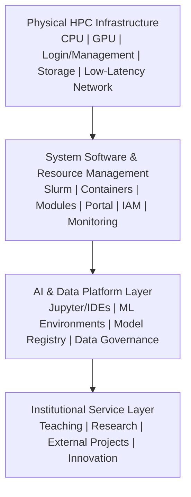

# Reference architecture

The layers are designed jointly. Physical resources without scheduler, identity,
storage policy, reproducibility mechanisms, support, and institutional service
ownership constitute a cluster, but not yet a sustainable university
cyberinfrastructure service.
